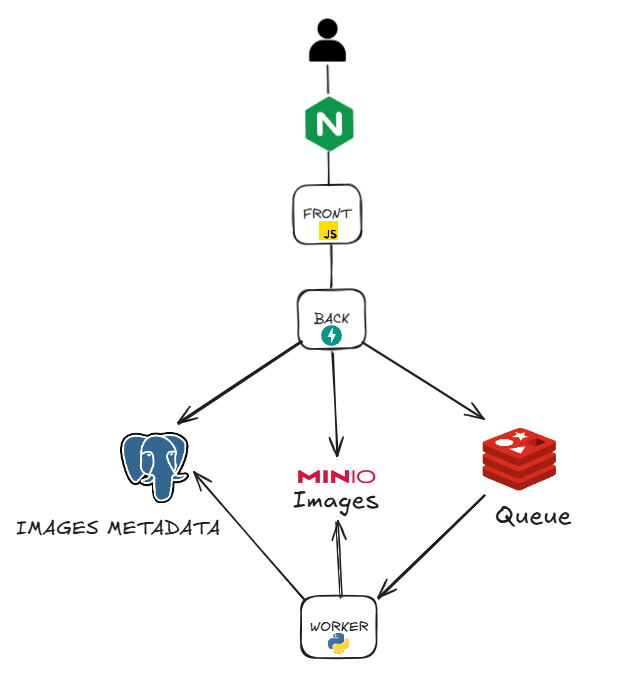
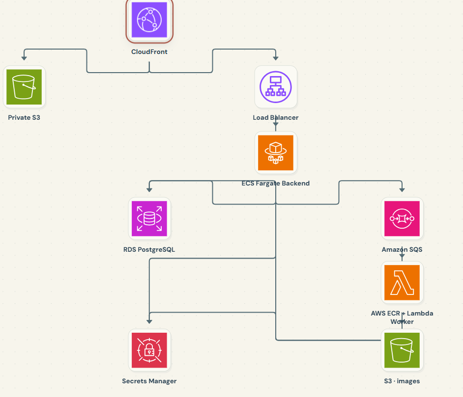

# Image Metadata Platform

Upload images, process them in the background, and view their dimensions and
thumbnails. Click a thumbnail to open the original image.

The application runs locally with Docker Compose or on AWS with Terraform.
Both deployments share the frontend, FastAPI backend, and image processing code.
This is a personal learning project, not a production-ready service.

## Local architecture

<!--  -->

*Add your diagram at `docs/diagrams/local.png` and uncomment the image above.*

Nginx serves the frontend and forwards API requests to the backend. The backend
stores original images in MinIO, saves records in PostgreSQL, and sends jobs to
Redis. A Python worker creates thumbnails, stores them in MinIO, and updates
the database. The frontend checks the processing status and displays the result.
Image downloads go through the backend.

## Run locally

You need Git and Docker with Docker Compose. After cloning the repository,
run these Bash commands from its root:

```bash
cp .env.example .env
docker compose up --build -d
```

The example credentials work for a fresh local setup. Keep your existing
`.env` if you already have one. The first build can take several minutes
because MinIO is compiled from a fixed source release.

Open the application at <http://localhost:8080> and upload a small image.
API documentation is available at <http://localhost:8080/docs>. The MinIO
console at <http://localhost:9001> uses the credentials in `.env`.

To view logs or rebuild after code changes:

```bash
docker compose logs -f backend worker
docker compose up --build -d
```

### Stop or delete the local deployment

Stop the services while keeping PostgreSQL and MinIO data:

```bash
docker compose down
```

Delete the containers and volumes. **This permanently deletes the local
database and stored images:**

```bash
docker compose down --volumes --remove-orphans
```

Add `--rmi all` to also remove the Docker images used by these services.
Your source files and `.env` are not deleted.

## AWS architecture

<!--  -->

*Add your diagram at `docs/diagrams/aws.png` and uncomment the image above.*

CloudFront serves the frontend from a private S3 bucket and forwards
`/api/*` requests to an Application Load Balancer. The ALB forwards them
to the FastAPI backend running on ECS Fargate.

The backend stores originals in a separate S3 bucket, saves metadata in RDS
PostgreSQL, and sends processing jobs to SQS. Lambda consumes these jobs,
creates thumbnails, stores them in S3, and updates RDS. ECR stores the
container images for the backend and Lambda worker.

Images are downloaded through temporary signed S3 URLs; the image bucket is
not public. RDS and Lambda's VPC connections use private subnets. The ALB and
Fargate tasks use public subnets, with backend inbound traffic restricted to
the ALB. Private subnets have no NAT gateway and access S3 and Secrets Manager
through VPC endpoints.

## Deploy to AWS

You need an AWS account, an authenticated AWS CLI profile, Terraform with
S3 `use_lockfile` support, and Docker with Buildx. Your AWS identity needs
permissions to manage the project's resources, including creating and passing
IAM roles.

**This deployment creates billable resources**, including RDS, Fargate, an
ALB, and VPC endpoints. The configuration targets `us-east-1`.
These Bash commands run from the repository root and assume a new deployment.

### 1. Configure your profile and bucket names

After cloning the repository, run from its root:

```bash
export AWS_PROFILE=your-profile
aws sts get-caller-identity
cp terraform/terraform.tfvars.example terraform/terraform.tfvars
```

Edit `terraform/terraform.tfvars` and choose globally unique image and frontend
bucket names. Keep your existing configuration if you already have a deployment.
Image tags default to `latest`.

### 2. Create the Terraform state bucket

Replace `your-state-bucket` with a globally unique name in both commands:

```bash
terraform -chdir=terraform/bootstrap init
terraform -chdir=terraform/bootstrap apply -var='state_bucket_name=your-state-bucket'
terraform -chdir=terraform init -backend-config='bucket=your-state-bucket'
```

For an existing deployment, use its current state bucket name. Do not change
buckets to update an existing deployment.

Bootstrap keeps its own state locally; keep it safe. The main deployment uses
S3 remote state, which can contain sensitive values.

### 3. Create ECR repositories and push the images

Repositories must contain images before the application can be deployed.
Use this targeted apply only for initial repository setup:

```bash
terraform -chdir=terraform apply \
  -target=aws_ecr_repository.backend \
  -target=aws_ecr_repository.worker
```

Build and push both images from the repository root:

```bash
BACKEND_IMAGE_REPO=$(terraform -chdir=terraform output -raw backend_ecr_url)
WORKER_IMAGE_REPO=$(terraform -chdir=terraform output -raw worker_ecr_url)
IMAGE_REGISTRY=${BACKEND_IMAGE_REPO%%/*}

aws ecr get-login-password --region us-east-1 |
  docker login --username AWS --password-stdin "$IMAGE_REGISTRY"

docker buildx build --platform linux/amd64 --provenance=false --sbom=false \
  -f backend/Dockerfile -t "$BACKEND_IMAGE_REPO:latest" --push .

docker buildx build --platform linux/amd64 --provenance=false --sbom=false \
  -f worker/Dockerfile.lambda -t "$WORKER_IMAGE_REPO:latest" --push .
```

If you changed the image tags in `terraform.tfvars`, use those tags instead.

### 4. Deploy and open the application

```bash
terraform -chdir=terraform plan
terraform -chdir=terraform apply
terraform -chdir=terraform output -raw frontend_url
```

Open the CloudFront HTTPS URL printed by the last command. RDS and CloudFront
can take several minutes to finish deploying.

For backend or worker updates, rebuild and push the image, then run a full
plan and apply. Terraform resolves tags to image digests to detect updates.
For frontend updates, edit `frontend/` and run plan and apply. CloudFront may
serve cached files until they expire or you invalidate them.

The local `.env` is not used on AWS. Terraform configures the application
and generates the database password, stored in Secrets Manager.
Do not commit `.env`, `terraform.tfvars`, or state files.

### Delete the AWS deployment

Use the same AWS profile and initialized working directory:

```bash
terraform -chdir=terraform destroy
```

Terraform shows the destruction plan and asks for approval. **Back up data you
want to keep first:** RDS does not create a final snapshot on deletion.

Non-empty S3 buckets and ECR repositories are not force-deleted. If cleanup
stops for that reason, empty the affected resources and run destroy again.
The image bucket is versioned: remove old object versions and delete markers too.

The separate bootstrap state bucket remains available for future deployments.
Only remove it after all resources tracked by the main state are gone and you
no longer need that state. Back up the state and empty the bucket, including
versions and delete markers, before running:

```bash
terraform -chdir=terraform/bootstrap destroy -var='state_bucket_name=your-state-bucket'
```
